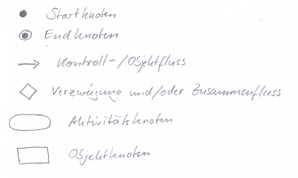
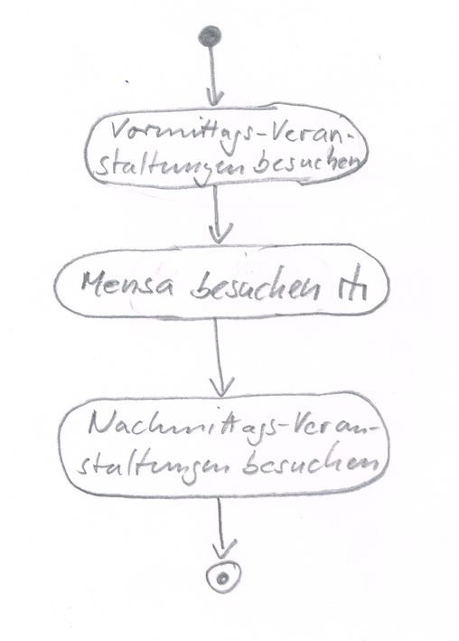
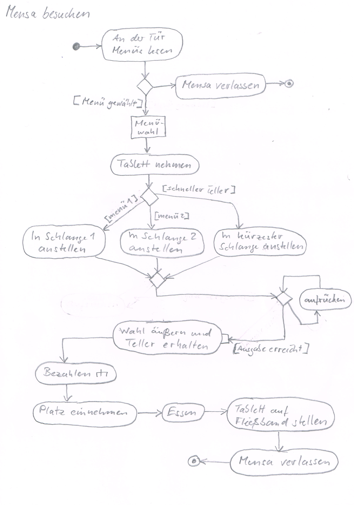
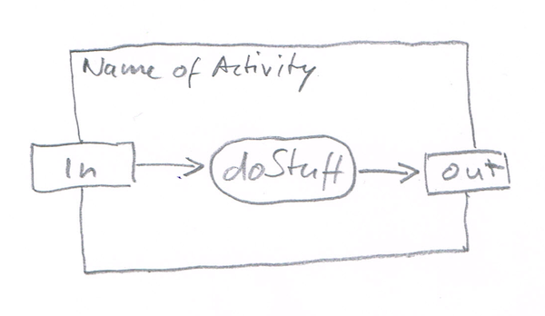
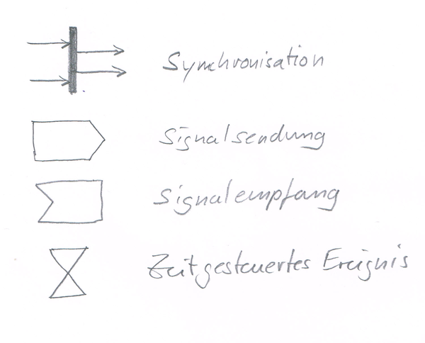
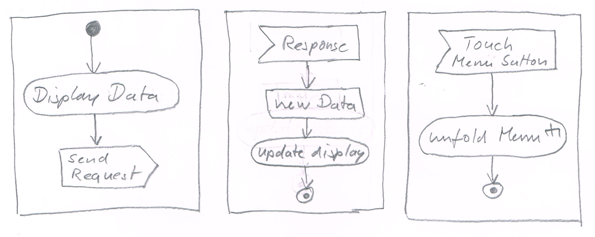
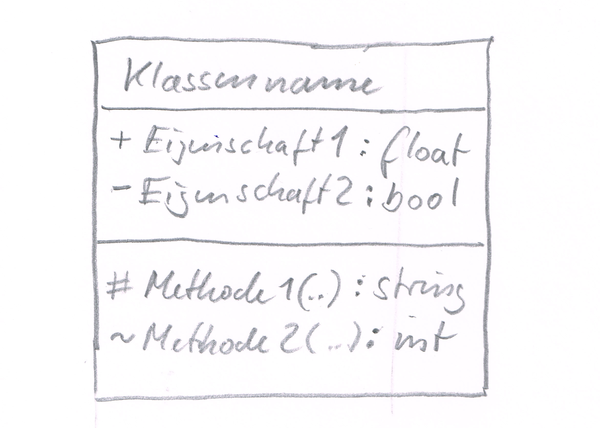
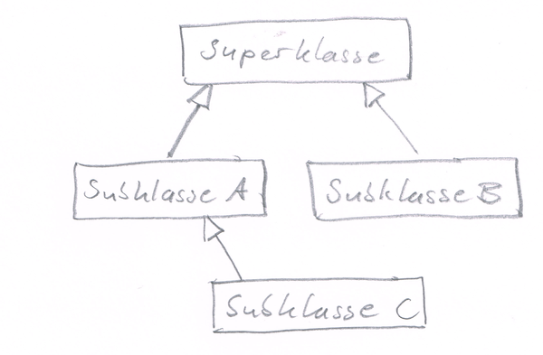

# UML: Aktivitäts- und Klassendiagramme

## Über UML

Die Entwicklung der Unified Modelling Language (UML) begann Mitte der 1990er Jahre, vorangetrieben vor allem
von den "drei Amigos": Grady Booch, James Rumbaugh und Ivar Jacobson. Alle drei arbeiteten bereits zuvor an
Schemata zur Planung von Software mit grafischen Hilfsmitteln und begannen schließlich bei der 
Firma Rational Software mit der Entwicklung einer gemeinsamen grafischen Sprache.
Die Version 2.5 der UML wurde im Mai 2015 veröffentlicht 
([siehe Website der Object Management Group](http://www.omg.org/spec/UML/2.5)).
Dort ist auch die umfangreiche [Spezifikation](http://www.omg.org/spec/UML/2.5/PDF) zur finden. Es sind
einige Arten von Diagrammen für unterschiedliche Zwecke definiert. In der Folge sollen nur Aktivitäts-
und Klassendiagramme betrachtet werden.

## Aktivitätsdiagramme

Mit Aktivitätsdiagrammen lassen sich ganz unterschiedliche Abläufe auf verschiedenen Abstraktionsebenen
beschreiben. Von generellen Prozessen, bei denen keine Maschinen beteiligt sind, bis zu Algorithmen für 
Computerprogramme. Dabei ist es möglich auch komplexe Abläufe mit Ausnahmen, Verzweigungen, Sprüngen und
Wiederholungen noch übersichtlich darzustellen, was in natürlicher Sprache nicht gelingen würde. Die
wesentlichsten Elemente sind dabei recht einfach zu erlernen.

### Einfachste Elemente

### Beispiel

Grundsätzlich wird der Ablauf durch Pfeile dargestellt, welche als Kontroll- bzw. Objektfluss bezeichnet 
werden. Es kann einen oder mehrere Start- und Endknoten geben. Im einfachsten Fall erfolgt der Fluss von
einem Startknoten über Aktivitätsknoten zu einem Endknoten. 

Die kleine Gabel bei der Aktivität "Mensa gehen" bedeutet, dass diese Aktivität an einer anderen Stelle
weiter ausgeführt wird. Dies könnte beispielsweise folgendermaßen aussehen:

Nach "An der Tür Menüs lesen" erfolgt eine Verzweigung. Sofern kein Menü zusagt wird die Mensa verlassen
und der Ablauf beendet. Erfolgt jedoch eine Wahl, so wird ein Objektknoten angelegt, welcher durch den
folgenden Fluss weiter gereicht wird und die Information über das gewählte Menü enthält. Nachdem das Tablett
genommen wurde, erfolgt eine Verzweigung auf Basis dieser Information, so dass die richtige Schlange für 
das Anstehen gewählt wird. Dann folgt eine Schleifenstruktur, womit das Aufrücken in der Schlange gewährleistet
wird. Das gewählte Menü ist für die dann folgende Aktivität erneut von Bedeutung, weshalb mit Hilfe des kleinen
Rechteckes am Eingang dargestellt wird, dass hier der Objektfluss eine Rolle spielt und der Aktivität 
entsprechende Information übergeben werden muss. Schließlich muss der Kunde angeben, ob er tatsächlich das 
Menü oder doch den schnellen Teller möchte. "Bezahlen" und "Platz suchen und essen" sind wieder komplexe 
Abläufe, die mit dem Gabel-Symbol versehen sind und an anderer Stelle ausgeführt werden
(nicht im Beispiel enthalten).

### Parameter

Die Aktivität "Wahl äußern und Teller erhalten" im Beispiel nimmt also ein Objekt aus dem Objektfluss
entgegen. Wird eine Aktivität im Detail dargestellt, werden ein- und ausgehende Objekte als Rechtecke 
auf den Rahmen gezeichnet.

Somit wird die Schnittstelle der Aktivität erkennbar, diese Objekte werden als Parameter der Aktivität 
bezeichnet. Die Parameter können als Start- und Endpunkte der Aktivität dienen. Es ist nun leicht, 
bei der Softwareentwicklung die Aktivität in eine Funktion zu übersetzen.

### Weitere Elemente

#### Synchronisation

Anders als bei der Raute, welche eine Verzweigung und/oder einen Zusammenfluss darstellt, bei dem jeweils
nur ein einziger Kontroll- bzw. Objektfluss aktiv ist, werden bei der Synchronisation mehrere Flüsse
gleichzeitig aktiv. Das bedeutet, dass diese Flüsse dann parallel abgearbeitet werden. Die abgehenden 
Flüsse werden dann aktiv, wenn bei der Synchronisation alle eingehenden Flüsse angekommen sind. 
Synchronisation kommt vordringlich beim Entwurf von Nebenläufigkeiten zum Einsatz. 

#### Ereignisse

Als Startknoten kann auch ein Signalempfang dienen. Das kann beispielsweise eine Nutzerinteraktion sein, 
ein Tastendruck, ein Mausklick oder Touch. Ebenso können Signale gesendet werden, zum Beispiel ein 
Request an einen Server. Die Response kann dann als Signalempfang den Start einer Aktivität auslösen. 
Hier einige stark vereinfachte Beispiele.

Für den Empfang zeitgesteuerter Ereignisse existiert zudem ein spezielles Symbol, welches einer Sanduhr
ähnelt.

### Weitere Spezifikationen

Im Detail gibt es noch sehr viel weiter greifende Spezifikationen für Aktivitätsprogramme, welche der 
entsprechenden Literatur zu entnehmen sind. Für einen ersten groben Entwurf von Software sollten die
hier angeführten allerdings weitestgehend genügen.  

## Klassendiagramme

Klassendiagramme stellen den Aufbau von Klassen und Zusammenhänge zwischen ihnen bzw. deren Objekte dar.
Das Klassendiagramm ist die wohl bekannteste und wichtigste Diagrammform der UML mit vielen Details. 
Es soll hier nur auf eine Auswahl der Notationen eingegangen werden, die es schon ermöglicht, 
komplexere objektorientierte Softwareprojekt relativ einfach und schnell zu planen und zu dokumentieren.

### Klasse

Eine Klasse wird dargestellt als einfaches Rechteck, welches horizontal in drei Teile geteilt wird.
Im oberen Teil ist der Klassenname angegeben, im mittleren Teil die Eigenschaften (Eigenschaften,
Properties) und im unteren Teil die Methoden, welche die Klasse zur Verfügung stellt. Wenigstens 
der obere Teil mit dem Namen muss vorhanden sein, die anderen beiden Teile sind je nach Ausprägung 
des Diagramms optional.  

  

Den Eigenschaften und Methoden können weitergehende Informationen angefügt werden. Im Beispiel
sind das die Datentypen (der Rückgabewerte) und die Sichtbarkeitsmodifikatoren. Bei letzteren 
gilt folgende Symbolik:  
`+` public  
`-` private  
`#` protected  
`~` package (entspricht `internal` in C#)  
Weiterhin können bei Bedarf Parameterlisten, Standardwerte oder Zusicherungen usw. angegeben werden.

### Interface

Ein Interface wird genauso notiert wie eine Klasse, lediglich über dem Klassennamen wird in doppelten 
spitzen Klammern ``<<interface>>`` dazu geschrieben.

### Beziehungen zwischen Klassen

In der Regel werden für ein Softwareprojekt viele verschiedene Klassen genutzt und implementiert, zwischen 
denen oder deren Objekten bestimmte Beziehungen existieren. 

#### Spezialisierung

Eine Linie mit einer nicht ausgefüllten Pfeilspitze an einem Ende zeigt die Spezialisierung einer Subklasse 
in Bezug auf die Superklasse und damit eine Vererbungsbeziehung an.

#### Implementierung

Implementiert eine Klasse ein Interface, so wird dies durch wie bei der Spezialisierung mit einem Pfeil mit 
leerer Spitze angezeigt. Dieser ist auf das Interface gerichtet. Allerdings ist die Linie gestrichelt. 
Alternativ wird ein "Lolly" an die Klasse gezeichnet, der mit dem Namen des entsprechenden Interfaces 
versehen ist. Dies soll wie ein Stecker wirken.

#### Verwendung

Einer Klasse, die ein Interface verwendet, wird eine entsprechende Buchse angefügt.

#### Allgemeine Assoziation

Eine allgemeine Beziehung zwischen Instanzen von Klassen wird mit einer simplen Verbindungslinie dargestellt. 
Allerdings können daran weitere Informationen notiert sein wie der Name der Assoziation, die Multiplizität 
(also ob es sich um eine 1:1-Beziehung, 1:n- oder n:m-Beziehung handelt), die Rollen usw.  

Im Beispiel sind Objekte der Klassen Prof (Professor\*in) und Studi (Student\*in) miteinander bezüglich der 
Thesis in Beziehung gesetzt. Der Assoziationsname lautet "schreibt bei". Die Zahlen und Bezeichnungen geben 
an, was das entsprechende Assoziationsende für das Gegenüber bedeutet und in welcher Anzahl es auftreten 
kann. Für Studi hat Prof die Rolle des Betreuers und hiervon kann es nur einen geben (Zweitbetreuer wird 
hier nicht betrachtet). Andersherum kann es 0 bis beliebig viele Studis für ein Prof geben, welche für ihn 
Betreute sind.  

Die Pluszeichen geben die Sichtbarkeit an, die Information soll also public sein. Die Pfeilspitzen geben an, 
in welche Richtung "navigiert" werden kann. Im Beispiel kann von dem Objekt Studi leicht auf den 
assoziierten Prof zugegriffen werden. Bei der Implementation könnte Studi also möglicherweise ein Attribut 
vom Typ Prof mit der entsprechenen Referenz erhalten. Die Assoziation ist hier bidirektional, vom Objekt 
Prof kann also auch leicht zu den betreuten Studis navigiert werden. Hier bietet sich ggf. ein Array vom Typ 
Studi als Attribut der Prof-Klasse an.

#### Aggregation

Die Aggregation stellt eine "Teil-von" Beziehung dar. Sie wird durch eine leere Raute auf der Seite des 
Aggregators, also des Ganzen, dargestellt. Dieser setzt sich logisch zumindest zu einem gewissen Grade aus 
den Teilen auf der anderen Seite zusammen.  

  

#### Komposition

Während die Aggregation lediglich eine schwache Spezialisierung der allgemeinen Assoziation darstellt, ist 
die Komposition deutlich strenger. Die Raute wird hierbei ausgefüllt. Die assoziierten Teile können nur Teil 
genau eines Ganzen sein und werden vernichtet, wenn das Ganze vernichtet wird.  

  

## Klassen definieren und optimieren mit Hilfe folgender Fragen

* Was ist es? 		-> Ableitung, Superklasse, implementierte Interface  
  Ist es eine Spezialisierung einer bereits vorhandenen Klasse? Gibt es Gemeinsamkeiten verschiedener 
  Klassen, in Eigenschaft oder Verhalten, die man in einer Superklasse definieren kann? Soll das 
  Gesamtsystem durch Spezialisierungen erweiterbar sein, ohne dass eine solche Erweiterung die Änderung 
  bereits bestehenden Codes erforderlich macht?  
  Die Beantwortung dieser Fragen hilft beim Entwurf einer Klassenhierarchie.
* Was hat es? 		-> Eigenschaften, Membervariablen  
  Welche Eigenschaften hat ein Objekt der Klasse? Was zeichnet es aus? Welche davon sind nur für das Objekt 
  selbst wichtig, auf welche müssen andere zugreifen können. Von welchem Typ sind die Eigenschaften, welche 
  Werte können sie annehmen und unter welchen Umständen werden die Werte geändert?  
  Die Beantwortung dieser Fragen hilft beim Entwurf der Attribute und deren Sichtbarkeitmodifikation.
* Was kann es? 		-> Methoden  
  Welche Verhaltensweisen weist ein Objekt der Klasse auf? Wie kann es sich oder seine "Umwelt" verändern? 
  Welchen Algorithmen folgt es?  
  Die Beantwortung dieser Fragen hilft beim Entwurf der Methoden.
* Was weiß es?		-> Verweise zu anderen Objekten  
  Welche Informationen benötigt das Objekt aus seiner "Umwelt" um funktionsfähig zu sein? Welche Referenzen 
  auf andere Objekte welcher Klassen werden von dem Objekt gehalten?  
  Die Beantwortung dieser Fragen hilft beim Entwurf der Assoziationen zwischen Objekten.
* Wer verwaltet es?	-> Erzeuger, Referenzierung 
  Wo und von wem wird das Objekt erzeugt? Wird es von einer zentralen Struktur dauerhaft referenziert? 
  Werden an anderer Stelle dauerhafte Referenzen gespeichert?  
  Die Beantwortung dieser Fragen hilft beim Entwurf der Assoziationen zwischen Objekten, insbesondere von Aggregationen und Kompositionen.